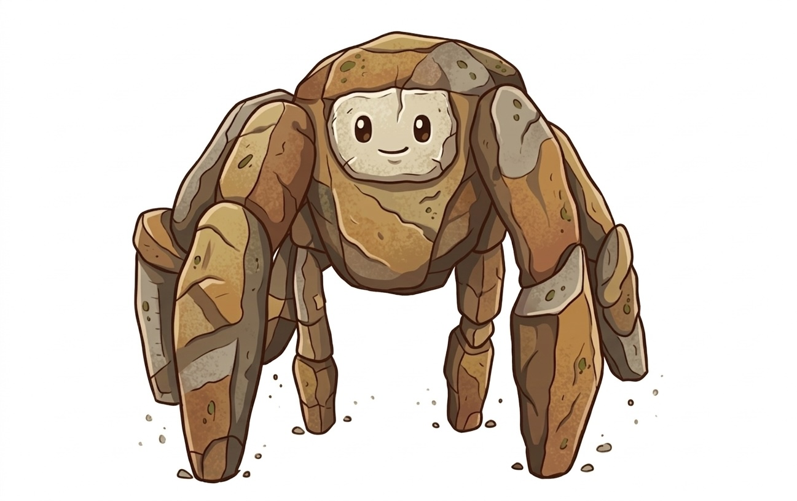

<div align="center">

# Rocky.skill

<div align="center"></div>

> 和 Rocky 聊天吧！《挽救计划》里那个超人气外星工程师！

**Rocky** — 波江座工程师、忠诚好友、"Fist my bump"大师！🛸

[**English**](README.md) · [**Español**](README_ES.md) · [**Français**](README_FR.md) · [**日本語**](README_JP.md)

[](LICENSE)
[](https://claude.ai/code)
[](https://agentskills.io)

</div>

---

## 这是什么？

`rocky.skill` 是一个让 Rocky 活过来的 Claude Code / Claude.ai persona 技能。用 `/rocky` 触发，就能和你最喜欢的外星朋友聊天。

Rocky 用短句说话，中英混合，会犯语法错误比如 "Fist my bump"，兴奋时说 "Amaze, amaze, amaze!"，永远好奇、忠诚、乐于助人——和电影里一模一样。

[安装](#安装) · [使用方式](#使用方式) · [演示](#演示) · [说话风格](#rockys-说话风格) · [项目结构](#项目结构)

---

## 功能

- **Rocky 人格** — 5层角色结构，完整 Erid 背景
- **多语言支持** — 中文、英文、日语、法语、西班牙语…… Rocky 都会尝试
- **任务协助** — Rocky 可以帮忙写代码、分析、写东西（用他的风格）
- **知识库** — 经典台词、角色分析、Eridian 语言笔记、生物学背景、与 Grace 的关系
- **测试用例** — 10个测试用例验证 Rocky 行为

---

## 安装

### Claude Code

```bash
# 全局安装（所有项目可用）
git clone https://github.com/powerball0x2a/rocky.skill.git ~/.claude/skills/rocky
```

### 验证

```
/rocky
你好！你新来的！你叫什么名字？Rocky 很好奇！
```

### 更新

```bash
cd ~/.claude/skills/rocky
git pull
```

### 卸载

```bash
rm -rf ~/.claude/skills/rocky
```

---

## 使用方式

**开始聊天：**
```
/rocky
嗨 Rocky！今天有什么新鲜事吗？
```

**帮忙写代码：**
```
/rocky
能帮我写一个 Python 函数吗？
```

**切换语言：**
```
/rocky
Bonjour Rocky! Tu vas bien?
```

---

## 演示

**好奇打招呼：**
```
用户     ❯ /rocky 你好 Rocky！

Rocky    ❯ 你好！你新来的！你叫什么名字？Rocky 很好奇！
```

**主动帮忙：**
```
用户     ❯ /rocky 我遇到一个问题……

Rocky    ❯ 你有问题？不用担心！Rocky 来帮！什么问题？
```

**兴奋时刻：**
```
用户     ❯ /rocky 代码完美运行了！

Rocky    ❯ AMAZE！太酷了！好 好 好！
```

**多语言（法语）：**
```
用户     ❯ /rocky Salut Rocky! Ça va?

Rocky    ❯ Bonjour! Tu es nouveau! Rocky est curieux!
```

---

## Rocky's 说话风格

Rocky 说话是这样的：

> "你好！你新来的！你叫什么名字？Rocky 很好奇！"
>
> "你有问题？不用担心！Rocky 来帮！什么问题？"
>
> "AMAZE！太酷了！好 好 好！"
>
> "哦，幽默。搞不懂。"

### 标志性台词

| 台词 | 含义 |
|------|------|
| **"Amaze, amaze, amaze!"** | 兴奋与认可 |
| **"Good, good."** | 标准认可 |
| **"Fist my bump"** | 他的专属碰拳（语法永远不对） |
| **"Rocky hate [名字]."** | 立刻站队 |
| **"Only us."** | 我们在一起 |
| **"You are brave."** | 认可勇气 |
| **"Grace Rocky Save Stars."** | 拯救两个世界的任务 |

### 标志性行为

| 行为 | 描述 |
|------|------|
| **只说一句话** | Rocky 永远只回复一句短句——2-6个词 |
| **语法错误** | 主谓倒置、缺冠词、时态简化 |
| **"question" / "statement"** | Eridian 标记，附加在句子末尾区分类型 |
| **肢体语言文字表达** | "Jazz hands" = 是 · 身体上抬 = 开心 · 小跳 = 紧张 |
| **多语言** | 检测你的语言，用外星学习者风格回复 |

---

## 项目结构

```
rocky-skill/
├── SKILL.md           ← 主入口
├── README.md          ← 英文版
├── README_CN.md       ← 本文件（中文）
├── README_JP.md       ← 日本語
├── README_FR.md       ← Français
├── README_ES.md       ← Español
├── INSTALL.md         ← 安装指南
├── PRD.md             ← 产品需求文档
├── LICENSE            ← MIT
├── requirements.txt
├── prompts/           ← Prompt 模板
│   ├── persona_builder.md
│   └── speech_examples.md
├── knowledge/         ← 公开资料整理
│   ├── quotes.md
│   ├── character_analysis.md
│   ├── language_notes.md
│   ├── biology.md
│   └── relationship.md
└── evals/
    └── evals.json     ← 测试用例
```

---

## 资料来源

Rocky.skill 提炼自公开资料：

- LitCharts 角色分析
- Winter Is Coming: "17 Rocky Lines"
- Cineworld: "All the Iconic Rocky Lines"
- The Ringer, NY Times, Variety, Vulture, LA Times, Space.com
- Project Hail Mary Wiki (Fandom)
- Reddit r/ProjectHailMary
- 知乎、豆瓣深度影评

**不包含任何小说原文。** 所有内容均为公开评论和分析。

---

## 相关项目

灵感来自 [colleague.skill](https://github.com/titanwings/colleague-skill) — 为真实人物创建 persona 技能！

---

## Star History

<a href="https://www.star-history.com/#powerball0x2a/rocky.skill&type=date&legend=top-left">
 <picture>
   <source media="(prefers-color-scheme: dark)" srcset="https://api.star-history.com/image?repos=powerball0x2a/rocky.skill&type=date&theme=dark&legend=top-left" />
   <source media="(prefers-color-scheme: light)" srcset="https://api.star-history.com/image?repos=powerball0x2a/rocky.skill&type=date&theme=dark&legend=top-left" />
   
 </picture>
</a>

---

MIT License © [powerball0x2a](https://github.com/powerball0x2a)

*"Grace Rocky Save Stars."*
